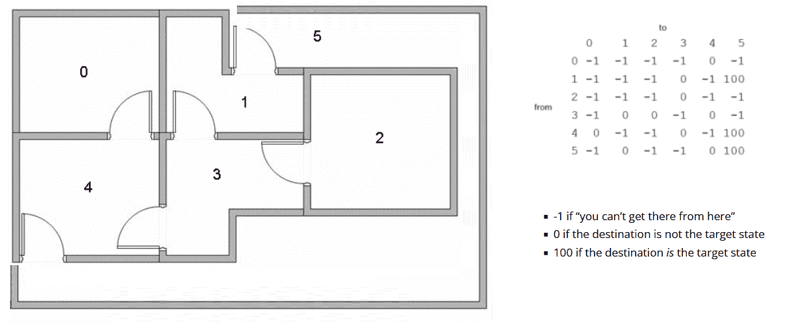

---
title: "人工智能知識及應用證書（兼讀制）: Q-Learnning"
output:
  html_notebook: default
--- 

Date : 01-Oct-2023 

### Question
* What is the best way to get from Room 2 to Room 5?

 


```{r}
source("https://raw.githubusercontent.com/NicoleRadziwill/R-Functions/master/qlearn.R")
```


```{r}
R <- matrix(c(-1,  -1, -1, -1,   0,   1,
              -1,  -1, -1,  0,  -1,   0,
              -1,  -1, -1,  0,  -1,  -1, 
              -1,   0,  0, -1,   0,  -1,
               0,  -1, -1,  0,  -1,   0,
              -1, 100, -1, -1, 100, 100), nrow=6, ncol=6, byrow=TRUE)
```


<br>
R is the rewards matrix as defined in the blog.<br>
N is the number of episodes to iterate<br>
alpha is the learning rate<br>
gamma is the discount factor<br>
tgt.state is the target state of the problem.<br>
```{r}
q.learn <- function(R, N, alpha, gamma, tgt.state) {
  ## initialize Q to be zero matrix, same size as R
  Q <- matrix(rep(0,length(R)), nrow=nrow(R))
  ## loop over episodes
  for (i in 1:N) {
    ## for each episode, choose an initial state at random
    cs <- sample(1:nrow(R), 1)   # returns a values between 1 and nrow(R) ; cs means current state
    ## iterate until we get to the tgt.state
    while (1) {
      ## choose next state from possible actions at current state
      ## Note: if only one possible action, then choose it;
      ## otherwise, choose one at random
      next.states <- which(R[cs,] > -1) #based on the R (reward), return a list of states higher than -1
      if (length(next.states)==1)  #if the list of states has only one, then select it; else select one of them randomly 
        ns <- next.states
      else
        ns <- sample(next.states,1)
      ## this is the update
      Q[cs,ns] <- Q[cs,ns] + alpha*(R[cs,ns] + gamma*max(Q[ns, which(R[ns,] > -1)]) - Q[cs,ns])
      ## break out of while loop if target state is reached
      ## otherwise, set next.state as current.state and repeat      
      if (ns == tgt.state) break
      cs <- ns
    }
  }
  ## return resulting Q normalized by max value
  return(100*Q/max(Q))
}
```

```{r}
results <- q.learn(R,N=10000,alpha=0.1,gamma=0.8,tgt.state=6) 
round(results)
```


```{r}
#     [,1] [,2] [,3] [,4] [,5] [,6]
#[1,]    0    0    0    0   64   80
#[2,]    0    0    0   51    0   80
#[3,]    0    0    0   51    0    0
#[4,]    0   64   41    0   64    0
#[5,]   64    0    0   51    0   80
#[6,]    0   84    0    0   84  100
```

```{r}
#      [,1] [,2] [,3] [,4] [,5] [,6]
#[1,]    -    -    -    -    -    -
#[2,]    -    -    -    -    -    1a
#[3,]    -    -    -   2ab   -    -
#[4,]    -    3a   -    -   3b    -
#[5,]    -    -    -    -    -    4b
#[6,]    -    -    -    -    -    5ab
```

### Reference
https://www.r-bloggers.com/2017/12/a-simple-intro-to-q-learning-in-r-floor-plan-navigation/
